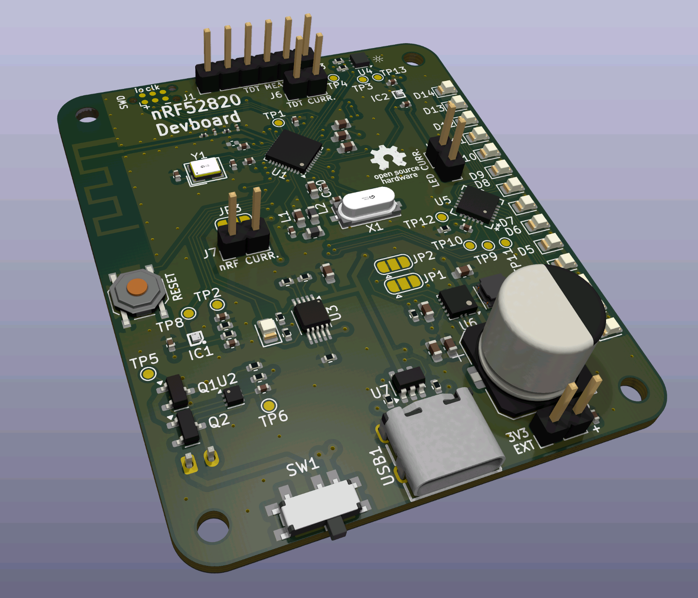
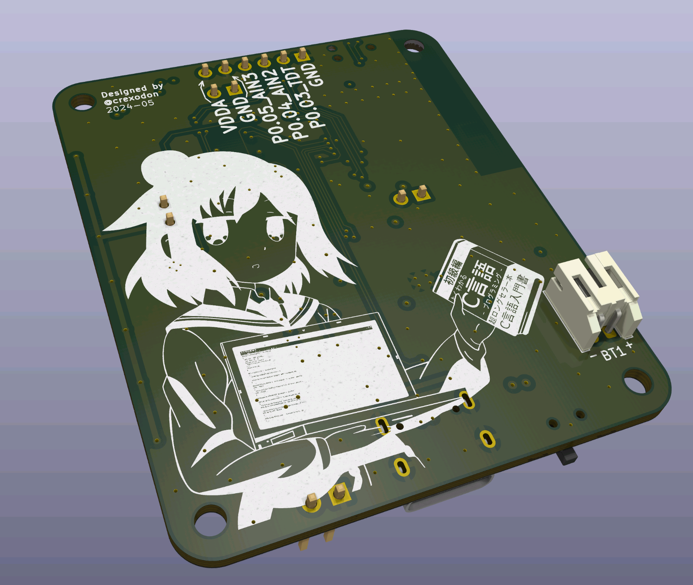

# Plant Thing Devboard

This Devboard features all the hardware except the TDT measuring circuit with testpoints and current probes at all needed positions.

Note: The back side anime image is from [here](https://github.com/cat-milk/Anime-Girls-Holding-Programming-Books/blob/master/C/Murakami_Shiina_Holding_Computer_C_Programming_Language.png)

## Schematic
[Schematic](docs/schematic.pdf)

## Features
### nRF52820
- Datasheet: https://infocenter.nordicsemi.com/pdf/nRF52820_PS_v1.0.pdf
- Bluetooth, Zigbee and Matter support
- 256kB Flash, 32kB Ram
- USB 2.0
- Built-in DCDC for more efficiency
- Inverted F Antenna based on [TI 2.4Ghz Design](https://www.ti.com/lit/an/swra117d/swra117d.pdf)
- RTC Oszillator connected for sleep states

### Sensors
- TDT (Time Domain Transmissiometry) with external PCB
- Light Sensor
- LED Bar for displaying moisture / status

### Power
- Support for single cell Li-ion / Li-Po battery
- Power over USB
- Power over external 3.3V

## Hardware
### Main ICs

| Label | Name          | Notes                                                                                                        |
| ----- | ------------- | ------------------------------------------------------------------------------------------------------------ |
| U1    | nRF52820-QDxx | Main MCU with Bluetooth/Zigbee/Matter support. Internal DCDC is enabled and VDDH is connected to the battery |
| U2    | BQ297xy       | Battery Protection IC with external mosfets                                                                  |
| U3    | BQ24090DGQ    | Battery Charging IC "Power Good" -> P0.17   "Charging" -> P0.16                                        |
| U4    | LT-303ALS     | Brightness Sensor with I²C "SDA" -> P0.15 "SCL" -> P0.14                                                                               |
| U5    | TLC59283RGER  | 16-Channel LED Driver "Blank" -> P0.20 "Lat" -> P0.28 "SCLK" -> P0.29 "SIN" -> P0.30                                                                                        |
| U6    | TPS63001      | 3.3V DCDC Buck/Boost Converter for TDT sensing circuit "Enable" -> P0.08                                                       |
| IC1   | NCP333FCT2G   | Load-Switch used for measuring voltage without load "Enable" -> P0.06 "Measure" -> P0.02 (AIN0)                                                         |
| IC2   | NCP333FCT2G   | Load-Switch used for switching power for TDT sensing circuit "Enable" -> P0.07                                                |
### Connectors

| Label | Name          | Note                                                                                                                                                    |
| ----- | ------------- | ------------------------------------------------------------------------------------------------------------------------------------------------------- |
| USB1  | Type-C USB    | With Data and CC Resistors                                                                                                                              |
| J1    | Arm SWD Debug | Tag-Connect Header                                                                                                                                      |
| J2    | LED Current   | Pinheader to measure current of the LEDs                                                                                                                |
| J3    | TDT Connector | Pinheader to connect TDT sensing circuit 1 -> GND 2 -> P0.03 (TDT AIN1) 3 -> P0.04 (AIN2) 4 -> P0.05 (AIN3) 5 -> GND 6 -> VDDA via J6 |
| J6    | TDT Current   | Pinheader to measure current of the TDT sensing circuit                                                                                                 |
| J7    | VDDH Current  | Pinheader to measure current of the nRF                                                                                                                 |
| J8    | 3.3V External | Pinheader to input 3.3V externally to the nRF                                                                                                                                                        |

### Solderbridges

| Label | Name                   | Note                                                                                                                                                            |
| ----- | ---------------------- | --------------------------------------------------------------------------------------------------------------------------------------------------------------- |
| JP1   | Bridge DCDC Enable     | Default: DCDC Enable and P0.08 is bridged  Alternative: DCDC Enbale is bridged to VIN (Note²: Check schematic, the outermost pins need to be bridged)        |
| JP2   | Bridge DCDC Power Save | Default: DCDC PS is connected to ground (PS Enable)  Alternative: DCDC PS is connected to VIN (Note²: Check schematic, the outermost pins need to be briged) |
| JP3   | Bridge VDDH to Battery | Default: VDDH and Battery (VCC) are bridged Alternative: VDDH and (external) 3.3V are connected (Note²: Check schematic, the outermost pins need to be bridged)                                                                                                                                                                |

### Testpoints

| Label | Name                                                         | Note                                             |
| ----- | ------------------------------------------------------------ | ------------------------------------------------ |
| TP1   | DEC5                                                         | DEC5 is not used                                 |
| TP2   | Battery Measurement                                          | Current Voltage of Battery after voltage divider |
| TP3   | Light Sensor SCL                                             | I²C Clock at Light Sensor                        |
| TP4   | Light Sensor SDA                                             | I²C Data at Light Sensor                         |
| TP5   | Battery Protections Mosfets                                  | Placed between Mosfets                           |
| TP6   | Positive Battery Pin at Protection IC (after 330Ohm resitor) |                                                  |
| TP8   | Battery Measurement Enable                                   | Enable Pin of the load switch                    |
| TP9   | LED SCLK                                                     | Clock Pin of LED Driver                          |
| TP10  | LED SIN                                                      | Data Pin of LED Driver                           |
| TP11  | LED LAT                                                      | Latch Pin of LED Driver                          |
| TP12  | LED Blank                                                    | Blanking Pin of LED Driver                       |
| TP13  | Light Sensor INT                                             | Interrupt Pin of Light Sensor (not used)                                                 |
